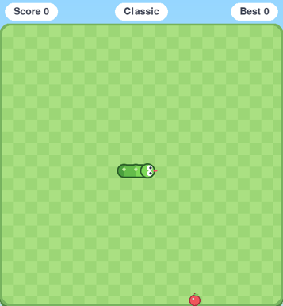
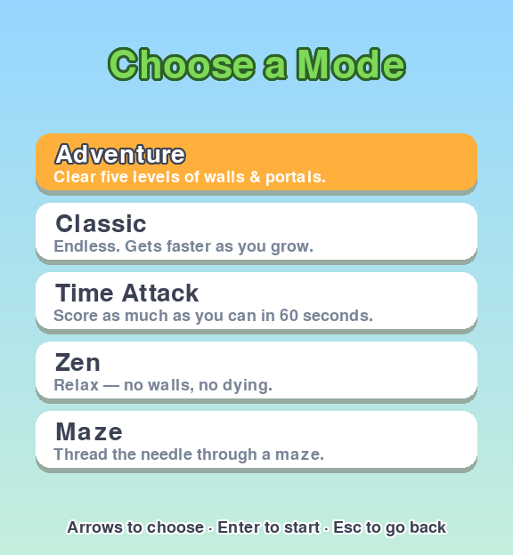

# 🐍 Tiny Baby Snake

<p align="center">
  
</p>

<p align="center">
  <em>A playful, professional-grade cartoon Snake game built with Python &amp; pygame.</em><br>
  Smooth 60fps movement, googly-eyed snakes, five game modes, power-ups,<br>
  unlockable skins, achievements, and juicy particle effects.
</p>

<p align="center">
  
  &nbsp;
  
  &nbsp;
  
</p>

## Highlights

- **Buttery-smooth movement** — logic and rendering are decoupled; the snake
  glides at 60fps by interpolating between fixed logic ticks.
- **Playful cartoon art** — a rounded, gradient snake with googly eyes that
  track its heading and a flicking tongue, on a grass checkerboard board.
- **Juice everywhere** — particle bursts, confetti, screen shake, colour
  flashes, floating score pop-ups, squash-and-stretch, and scene transitions.
- **Five game modes** — Adventure, Classic, Time Attack, Zen, and Maze.
- **Power-ups & bonus food** — Slow-Mo, Double, Ghost, Magnet, Shrink, and
  golden bonus fruit.
- **Progression** — a persistent profile with per-mode high scores, lifetime
  stats, achievements, and unlockable snake skins.
- **Settings** — master/music/SFX volume and a screen-shake toggle.
- **Procedural audio** — every sound effect and both music tracks are
  synthesized from code (numpy), no binary source assets required.
- **Tested & packaged** — 74 headless unit tests, CI, and a one-file build.

## Game modes

| Mode | Description |
|---|---|
| **Adventure** | Clear five hand-built levels of walls & teleport portals |
| **Classic** | Endless open board that speeds up as you grow |
| **Time Attack** | Score as much as you can in 60 seconds |
| **Zen** | No walls, no dying — just vibes |
| **Maze** | Thread the needle through a maze that kills on contact |

## Power-ups

Available in every mode except Adventure. Grab the floating gem to trigger it:

| | Power-up | Effect |
|---|---|---|
| **S** | Slow-Mo | Halves your speed for a while |
| **x2** | Double | Doubles points earned |
| **G** | Ghost | Pass through walls and yourself |
| **M** | Magnet | Pulls food toward your head |
| **–** | Shrink | Trims a few segments off your tail |

Golden **bonus fruit** appears periodically and is worth 5×, but it vanishes if
you're too slow.

## Setup

Requires Python 3.11+.

```bash
python3 -m venv venv
venv/bin/pip install -r requirements.txt
venv/bin/python main.py
```

## Controls

| Key | Action |
|---|---|
| Arrow keys / WASD | Steer · navigate menus |
| Enter | Select · advance level · restart |
| P / Space | Pause / resume |
| M | Mute / unmute |
| Esc | Back · quit |

## Development

```bash
venv/bin/pip install -r requirements-dev.txt
pytest                              # 74 headless tests, no display needed
python tools/gen_sounds.py          # regenerate audio (numpy)
python tools/gen_media.py           # regenerate screenshots + GIF
```

### Build a standalone executable

```bash
pyinstaller tiny-baby-snake.spec --noconfirm
./dist/tiny-baby-snake
```

**Windows:** every push builds a standalone `tiny-baby-snake.exe` in CI — grab
it from the **Actions** tab → latest run → *Artifacts* → `tiny-baby-snake-windows`
(no Python install needed to run it). Tagged releases also attach the `.exe`
automatically.

## Architecture

The game logic core imports **no pygame**, so it runs and unit-tests fully
headless. Presentation is layered on top.

| Path | Responsibility |
|---|---|
| `engine/` | Pure game logic — snake, food, levels, modes, power-ups, profile, achievements, `game.py` |
| `fx/` | Cartoon drawing, theme/skins, particles, camera (shake/flash) |
| `scenes/`, `ui/` | Presentation scaffolding |
| `renderer.py` | Draws a `Game` to the screen with effects |
| `input_handler.py` | Keyboard events → intents |
| `audio.py` | Sound-effect & music playback |
| `storage.py`, `paths.py` | Persistence & bundled-asset resolution |
| `main.py` | Entry point + fixed-timestep game loop |
| `tools/` | Asset generators (`gen_sounds.py`, `gen_media.py`) |
| `tests/` | 74 unit tests |

## Roadmap

- Local 2-player Versus mode
- Daily challenge seeds
- Online leaderboards

## License

MIT
