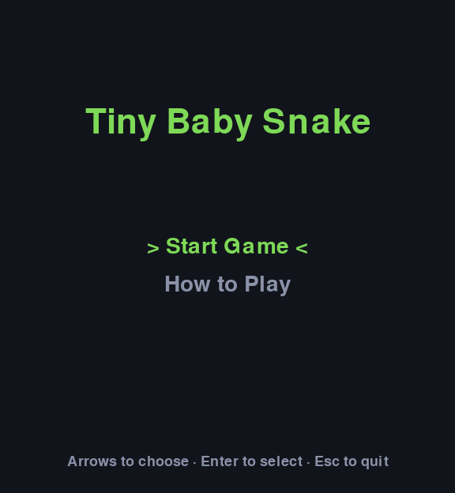
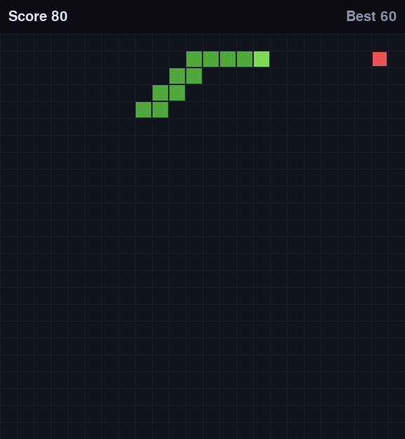
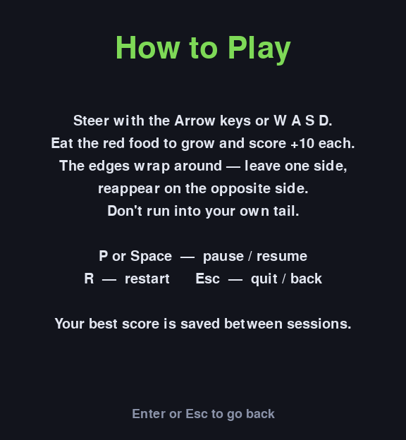
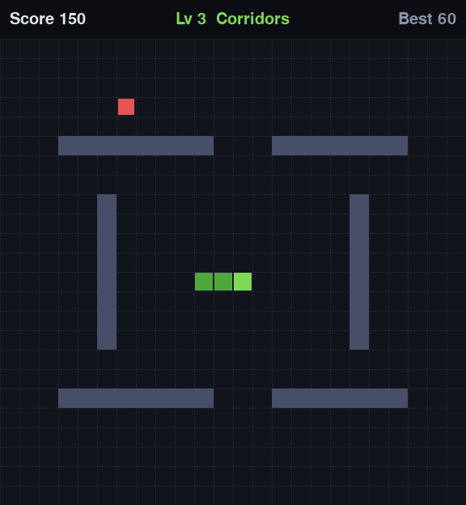
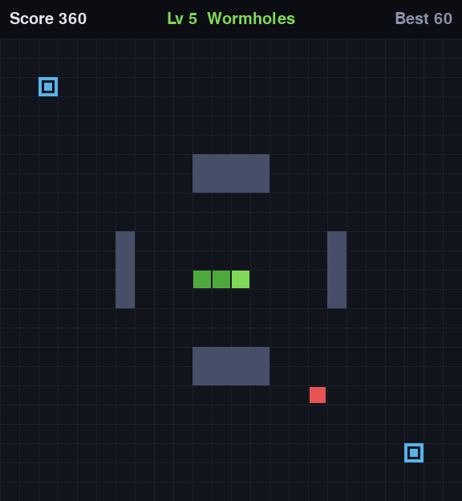

# Tiny Baby Snake

<p align="center">
  
</p>

<p align="center">
  <em>A classic Snake game built with Python and pygame.</em><br>
  Steer a growing snake around a wrapping grid, eat food to score,<br>
  and try not to run into your own tail.
</p>

<p align="center">
  
  &nbsp;&nbsp;
  
</p>

## Features

- Start menu with a "How to Play" screen
- **Five levels of rising difficulty** — reach a target score to advance
- **Complex wall layouts** that end the game on contact
- **Teleporting food** that relocates if you take too long
- **Portals** that whisk the snake's head across the board
- Wrap-around edges — leave one side, reappear on the opposite side
- Score tracking with a high score persisted between sessions
- Pause / resume and restart
- Arrow-key or WASD controls
- Core game logic decoupled from pygame, so it runs and unit-tests headlessly

## Levels

Clear a level by reaching its target score, then press Enter to advance. Each
level keeps your score and drops the snake into a fresh layout.

<p align="center">
  
  &nbsp;&nbsp;
  
</p>

| # | Level | Twist |
|---|---|---|
| 1 | Open Field | Classic open board |
| 2 | Pillars | Four obstacle blocks |
| 3 | Corridors | A maze of walls |
| 4 | Shifting Feast | Food teleports if you dawdle |
| 5 | Wormholes | Portals + teleporting food |

## Setup

Requires Python 3 and pygame.

```bash
python3 -m venv venv
venv/bin/pip install pygame
```

## Play

```bash
venv/bin/python main.py
```

**Controls**

| Key | Action |
|---|---|
| Arrow keys / WASD | Steer (or navigate the menu) |
| Enter | Select menu option / advance level / restart after game over |
| P or Space | Pause / resume |
| R | Restart |
| Esc | Quit (or back out of the info screen) |

## Tests

```bash
venv/bin/pip install pytest
venv/bin/python -m pytest tests/ -v
```

The core modules (`game`, `snake`, `food`, `storage`) import no pygame, so the
suite runs without a display.

## Layout

| File | Responsibility |
|---|---|
| `main.py` | Entry point + game loop |
| `game.py` | Game state and update logic |
| `levels.py` | Level layouts, walls, portals |
| `snake.py` | Snake entity |
| `food.py` | Food entity |
| `storage.py` | High-score persistence |
| `renderer.py` | Drawing to the pygame surface |
| `input_handler.py` | Keyboard events → game intents |
| `config.py` | Constants and shared enums |
| `tests/` | Unit tests |
